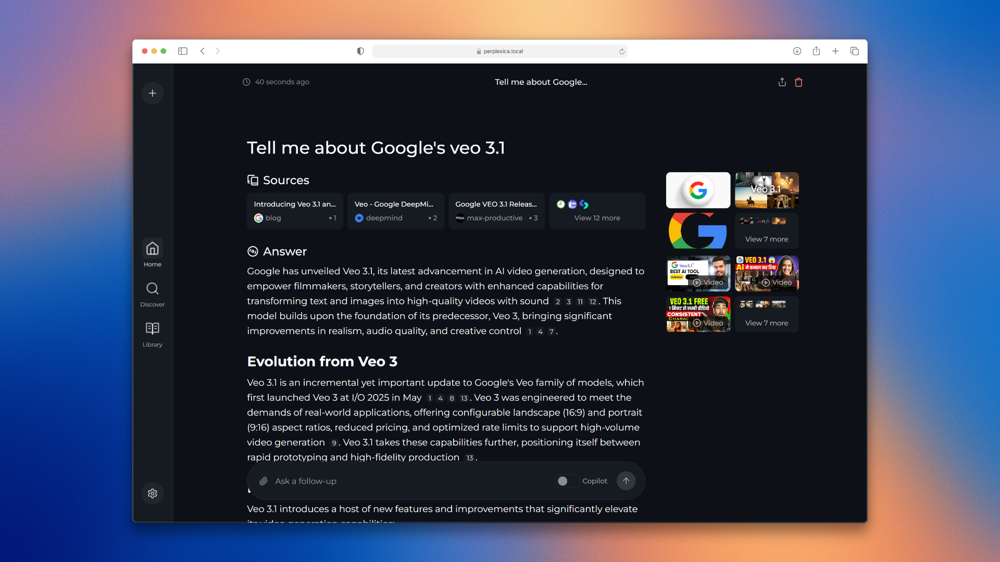

# OpenPerplexity

OpenPerplexity is a local-first research workspace that combines live web search, cited answers, configurable model routing, and document uploads in a single interface.



## Highlights

- Live search with cited answers
- Configurable chat and embedding providers
- Search modes for fast, balanced, or deeper research
- Built-in widgets for weather, finance, calculations, and more
- File uploads with semantic retrieval over local documents
- Local chat history stored on your own machine

## Run with Docker

Build the default image:

```bash
docker build -t openperplexity:latest .
```

Run it with the bundled SearXNG service:

```bash
docker run -d \
  -p 3000:3000 \
  -v openperplexity-data:/home/openperplexity/data \
  --name openperplexity \
  openperplexity:latest
```

Open [http://localhost:3000](http://localhost:3000) and finish setup in the UI.

### Slim image

If you already operate your own SearXNG instance, build the slim image instead:

```bash
docker build -f Dockerfile.slim -t openperplexity:slim-latest .
```

```bash
docker run -d \
  -p 3000:3000 \
  -e SEARXNG_API_URL=http://your-searxng-url:8080 \
  -v openperplexity-data:/home/openperplexity/data \
  --name openperplexity \
  openperplexity:slim-latest
```

SearXNG must have JSON responses enabled and the Wolfram Alpha engine available.

## Run from source

1. Place this source tree in your workspace.
2. Install dependencies:

```bash
npm install
```

3. Start the development server:

```bash
npm run dev
```

4. For a production build:

```bash
npm run build
npm run start
```

The app listens on port `3000` by default.

## Browser search shortcut

To use OpenPerplexity from your browser's address bar, add a site search entry pointing to:

```text
http://localhost:3000/?q=%s
```

Replace `localhost` or `3000` if you host the app elsewhere.

## API

OpenPerplexity exposes a search API for programmatic use. See [docs/API/SEARCH.md](docs/API/SEARCH.md).

## Architecture and maintenance

- Architecture overview: [docs/architecture/README.md](docs/architecture/README.md)
- High-level request flow: [docs/architecture/WORKING.md](docs/architecture/WORKING.md)
- Updating deployments: [docs/installation/UPDATING.md](docs/installation/UPDATING.md)
- Contribution notes: [CONTRIBUTING.md](CONTRIBUTING.md)

## Troubleshooting

### No providers configured

If the app reports that no chat providers are configured:

1. Confirm the provider base URL is reachable from the app process.
2. Confirm the configured model key matches an available model on that provider.
3. If your provider expects an API key field, ensure it is not blank.

### Ollama connection issues

If Ollama is unreachable from the app:

- macOS / Docker Desktop: `http://host.docker.internal:11434`
- Windows / Docker Desktop: `http://host.docker.internal:11434`
- Linux: `http://<host-private-ip>:11434`

If needed, expose Ollama on all interfaces with `OLLAMA_HOST=0.0.0.0:11434`.

### Lemonade connection issues

If Lemonade is unreachable from the app:

- macOS / Docker Desktop: `http://host.docker.internal:8000`
- Windows / Docker Desktop: `http://host.docker.internal:8000`
- Linux: `http://<host-private-ip>:8000`

Also confirm the service is bound to `0.0.0.0` and that the port is not blocked by a firewall.
